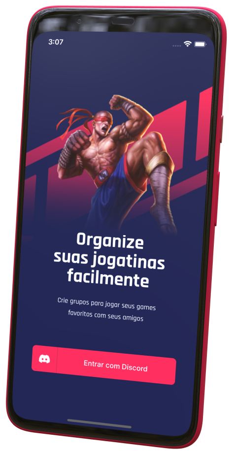

<h1 align="center">
    
</h1>

<p align="center">
  <a href="#screenshots">Screenshots</a>&nbsp;&nbsp;&nbsp;|&nbsp;&nbsp;&nbsp;
  <a href="#rocket-tecnologias">Tecnologias</a>&nbsp;&nbsp;&nbsp;|&nbsp;&nbsp;&nbsp;
  <a href="#-projeto">Projeto</a>&nbsp;&nbsp;&nbsp;|&nbsp;&nbsp;&nbsp;
  <a href="#memo-licença">Licença</a>
</p>

<h2 align="center">📸 Screenshots</h3>
<p align="center">
    
</p>

## :rocket: Tecnologias

Esse projeto foi desenvolvido com as seguintes tecnologias:

- [Node.js](https://nodejs.org/en/)
- [React](https://reactjs.org)
- [React Native](https://facebook.github.io/react-native/)
- [Expo](https://expo.io/)

## 💻 Projeto

Gameplay é o lugar para você se conectar com seus amigos via Discord e organizar suas jogatinas em seus
jogos favoritos.

### Instalação

2. Clone o repositório
   ```sh
   git clone git@github.com:bruno-lombardi/gameplay.git
   ```
3. Instale as dependências
   ```sh
   yarn install
   ```
4. Execute no iOS ou Android
   ```sh
   yarn ios
   # yarn android
   ```

## :memo: Licença

Esse projeto está sob a licença MIT. Veja o arquivo [LICENSE](LICENSE.md) para mais detalhes.

---

Feito com ♥ by Bruno Lombardi, com a ajuda da maravilhosa 🚀 [Rocketseat](https://github.com/Rocketseat).